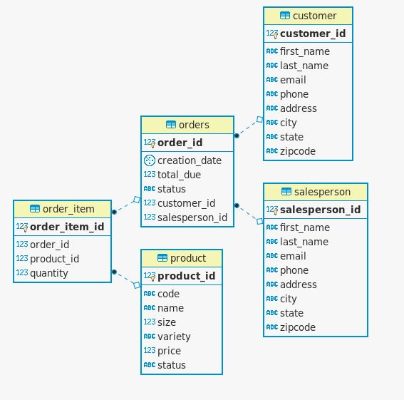

# JDBC Project #
## 1) Introduction ##
Project is to introduce how to use JDBC libraries. JDBC is a  fundamental java library that allows connection between a Java application 
and a RDBMS - in this project's case PostgreSQL. In this project implement OrderDao by writing the findById` method

## 2) ER Diagram ##

# 3) Discuss DAO and Repository patterns ##
### DAO ###
DAO can be an abstraction layer or a true object. DAO is generally works with DTO as input and output to the DAO. DTO provides single domain of data often in forms of tables. DAO is generally closer to the database in that operations are performed with access to database. Therefore for atomic transactions, it is better to use DAO pattern.

### Repository ###
Repository pattern focuses only on single table access per class. Is very similar to DAO when handling just 1 table. Is further away from database operations and if joining is done with this pattern, would be done in the code. Strength of repository pattern is that it allows sharding of the database since data access is by table and it doesn't require access to the entire database.

