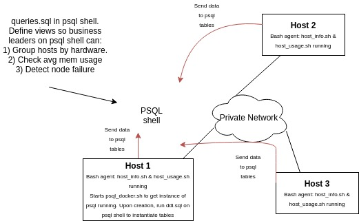

## 1) Introduction ##
Cluster Monitor Agent is an internal tool that monitors the cluster resources. It manages servers connected 
internally via switch and records the hardware specifications and storage details of the servers and stores 
them into a database via PostgreSQL. The infrastructure team is then able to query information regarding server 
host id by CPU number and sort by their memory size, average memory usage of each host and display when servers 
are down.

## 2) Architecture and Design ##

## 3) Explanation of files ##
###### 1) `./scripts/host_info.sh` ######
Collects the host's hardware information and inserts into host_info table. Run once on bash agent start.
###### 2) `./scripts/host_usage.sh` ######
Collects host usage data - CPU & RAM, and inserts into host_usage table. Is executed every minute using chrontab.
###### 3) `./scripts/psql_docker.sh` ######
Uses docker to setup psql server
###### 4) `./sql/ddl.sql` ######
Contains create_table definitions for host_info and host_usage tables
###### 5) `./sql/queries.sql` ######
Contains queries to return analysis of tables. Queries include:
	1. Grouping hosts by hardware information
	2. Printing the average memory use of all hosts
	3. Detects whether node failure occurs in any of the hosts

## 4) Script Usage ##
`./scripts/psql_docker.sh (start|stop) [password|]`   
`./scripts/host_info.sh psql_host psql_port db_name psql_user psql_password`   
	EXAMPLE: `./scripts/host_info.sh localhost 4532 host_agent postgres password`   
`./scripts/host_usage.sh psql_host psql_port db_name psql_user psql_password`   
	EXAMPLE: `./scripts/host_usage.sh localhost 4532 host_agent postgres password`   
**To ensure that host_usage script runs every minute make use of crontab:** 
1. Run `crontab -e` in terminal
2. input command `* * * * * bash <full_path to host_usage.sh>  psql_host psql_port db_name psql_user psql_password > /tmp/host_usage.log` in terminal   
	Example:  
`* * * * * bash /home/centos/dev/jarvis_data_eng_David_Yang/linux_sql/scripts/host_usage.sh localhost 5432 host_agent postgres password > /tmp/host_usage.log` 

## 5) Improvements ##
Things I think can be added to the project:
1) Add more queries to ./sql/queries.sql to analyze more of the data.
2) Extend the tables in the database to include other critial information.
3) Allow servers outside private network to add data to the database.
