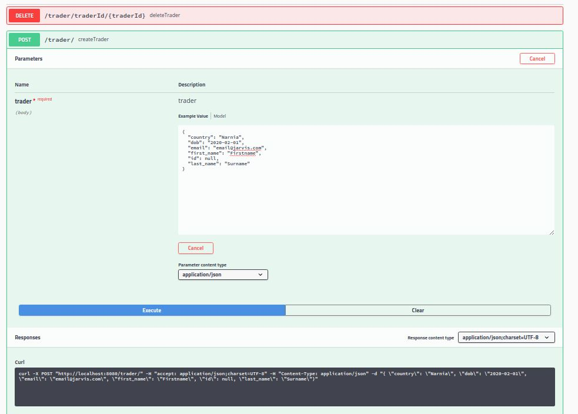
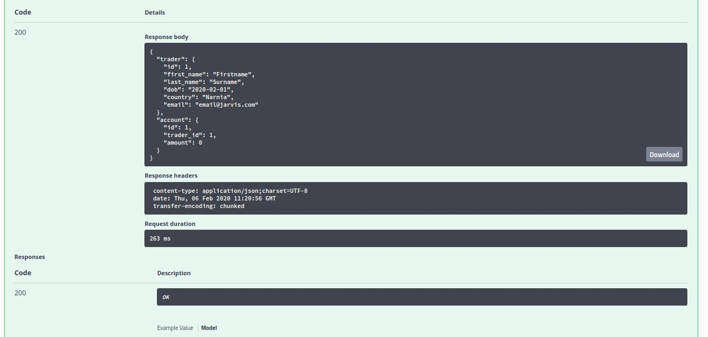
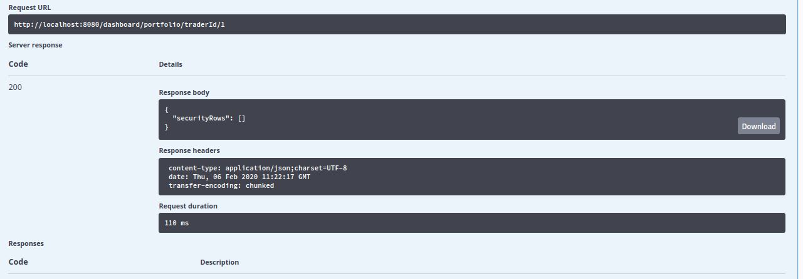
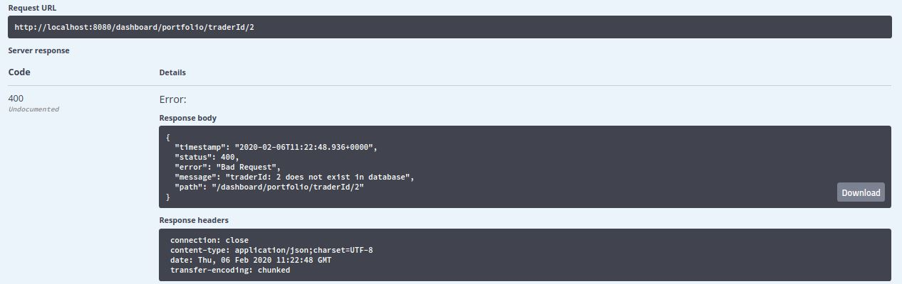

# SpringBoot Project

## Table of Contents
[Introduction](# Introduction)
[Quick Start](# Quick Start)
[Architecture](# Architecture)

# Introduction
This trading application is an online stock trading simulation REST API 
that allows a trader to create a trading account. The trader can then use 
this account to buy securities - data for this is retrieved via REST API.
<br />
This microservice is implemented via SpringBoot to handle dependencies
between DAO, Service & Controller layers via MVC model. To retrieve
IEX market data we use REST API, and then persist this data locally via
Postgres.

# Quick Start
Prerequisites:
1) Need Docker version 17.05 or higher. Check via `docker -v`<br />
2) Centos 7<br />
Run via:<br />
```
#Set IEX_PUB_TOKEN if not set as environment variable
set IEX_PUB_TOKEN="<INSERT IEX TOKEN>"
./startDocker.sh
```
`startDocker.sh` will create docker network for Postgres database to 
communicate with the trading application, build docker image for both 
Postgres and the trading application. Create a container instance for 
both Postgres and the trading application then run both containers.

Following screenshots walks through example tests:<br />
Firstly through TraderAccountController I create a new trader

Output displays that this operation is successful

Next using DashboardController I check that trader has actually been created

In previous example, dashboardController output shows trader has been 
created. In below example, I try to find TraderAccountView of 
a non-created Trader to display difference from above


# Architecture

## Control Layer:
Consists of:<br />
1) DashboardController<br />
2) OrderController<br />
3) QuoteController<br />
4) TraderAccountController<br />
Controllers handle user requests sent in via webservlet. 

## Service Layer
Consists of:<br />
1) DashboardService<br />
2) OrderService<br />
3) QuoteService<br />
4) TraderAccountService<br />
Service layer 

## DAO layer
Consists of:<br />
1) AccountDao<br />
2) JdbcCrudDao<br />
3) MarketDataDao<br />
4) PositionDao<br />
5) QuoteDao<br />
6) SecurityOrderDao<br />
7) TraderDao<br />

## SpringBoot: webservlet/TomCat and IoC
SpringBoot provides webservlet to 

## PSQL and IEX
Postgres persists data retrieved from IEX Cloud via REST API. It 
additionally stores other data needed by trading application.

# REST API USAGE

## Swagger

## Quote Controller

## Trader Controller

## Order Controller

## Dashboard Controller 


# Docker Deployment

# Improvements

