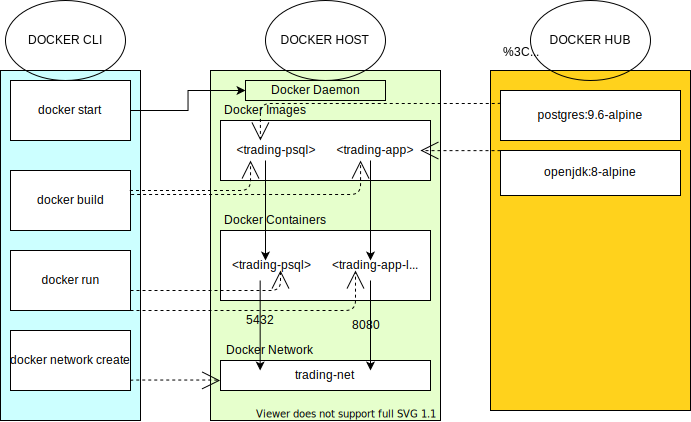

# SpringBoot Project

## Table of Contents
* [Introduction](#introduction)
* [Quick Start](#quickStart)
* [Architecture](#architecture)
* [REST API Usage](#restApiUsage)
* [Docker Deployment](#dockerDeployment)
* [Improvements](#improvements)

## Introduction
This trading application is an online stock trading simulation REST API 
that allows a trader to create a trading account. The trader can then use 
this account to buy securities - data for this is retrieved via REST API.
<br />
This microservice is implemented via SpringBoot to handle dependencies
between DAO, Service & Controller layers via MVC model. To retrieve
IEX market data we use REST API, and then persist this data locally via
Postgres.

## Quick Start
Prerequisites:
1) Need Docker version 17.05 or higher. Check via `docker -v`<br />
2) Centos 7<br />
Run via:<br />
```
#Set IEX_PUB_TOKEN if not set as environment variable
set IEX_PUB_TOKEN="<INSERT IEX TOKEN>"
./startDocker.sh
```
`startDocker.sh` will create docker network for Postgres database to 
communicate with the trading application, build docker image for both 
Postgres and the trading application. Create a container instance for 
both Postgres and the trading application then run both containers.

Following screenshots walks through example tests:<br />
Firstly through TraderAccountController I create a new trader

Output displays that this operation is successful

Next using DashboardController I check that trader has actually been created

In previous example, dashboardController output shows trader has been 
created. In below example, I try to find TraderAccountView of 
a non-created Trader to display difference from above


## Architecture

### Control Layer:
Consists of:<br />
1) DashboardController<br />
2) OrderController<br />
3) QuoteController<br />
4) TraderAccountController<br />
Controllers handle user requests inputted through API Endpoints.
Mapping of each Endpoint API is defined here. Within each controller 
method, typically executes Service layer - if fails will check for 
what type of exception to throw.

### Service Layer
Consists of:<br />
1) DashboardService<br />
2) OrderService<br />
3) QuoteService<br />
4) TraderAccountService<br />
Service layer will typically parse inputs from Controller layer, and 
throw IllegalArgumentExceptions if bad inputs are sent. Otherwise will 
perform business logic on data returned from DAO layer.

### DAO layer
Consists of:<br />
1) AccountDao<br />
2) JdbcCrudDao<br />
3) MarketDataDao<br />
4) PositionDao<br />
5) QuoteDao<br />
6) SecurityOrderDao<br />
7) TraderDao<br />
Communicates directly with Postgres database with DataSource Object (Using JDBC 
to connect). MarketDataDao communicates via REST API to IEX Cloud; other DAO's 
are used to perform CRUD operations on Postgres database.

### SpringBoot: webservlet/TomCat and IoC
SpringBoot uses IoC to provide dependency management to the trading application.
Webservlet/Tomcat converts DTO data to JSON for data returning to user 
and JSON data to object data for inputs to trading application.

### PSQL and IEX
Postgres persists data retrieved from IEX Cloud via REST API. It 
additionally stores other data needed by the trading application.

## REST API Usage
### Swagger
Swagger allows you to describe the structure of your APIs so that machines
 can read them. Swagger supports reading JSON outputs of this application.

### Quote Controller
 + `GET /quote/dailyList`
   * Get a list of updated stocks available.
 + `GET /quote/iex/ticker/{ticker}`
 	 * Get stock information according to IEX ticker.
 + `GET /quote/iex/tickers/`
 	 * Input a list of IEX tickers to retrieve list of stock information 
	 corresponding to each unique IEX ticker inputted.
 + `POST /quote/tickerId/{tickerId}`
   * Retrieve IEX ticker stock information and add it to available stocks.
 + `PUT /quote/`
   * Manually update stock quote information.
 + `PUT /quote/iexMarketData`
   * Automatically update information for all stocks available.

### TraderAccount Controller
 + `DELETE /trader/traderId/{traderId}`
   * Delete a trader iff its account balance is 0.0, and has no stocks.
 + `POST /trader/`
   * Create a trader and an account via DTO on Swagger.
 + `POST /trader/firstname/{firstname}/lastname/{lastname}/dob/{dob}/country/{country}/email/{email}`
   * Create a trader and an account via fields inputted in URL.
 + `PUT /trader/deposit/traderId/{traderId}/amount/{amount}`
   * Deposits inputted amount of money into a trader's account.
 + `PUT /trader/withdraw/traderId/{traderId}/amount/{amount}`
   * Withdraws inputted amount of money into a trader's account.

### Order Controller
 + `POST /order/marketOrder`
   * Submits a marketOrder - Trader can buy or sell a certain amount of stock 
	 according to the orderDTO inputted.

### Dashboard Controller 
 + `GET /dashboard/portfolio/traderId/{traderId}`
   * Get list of Stock along with its Stock Market information and information 
	 about how much of this Stock the trader owns.
 + `GET /dashboard/profile/traderId/{traderId}`
   * Get Trader and Account information corresponding to traderId input.

## Docker Deployment

PSQL initializes table by copying ddl sql script into initialization directory: 
`/docker-entrypoint-initdb.d`. When we start the container with `docker run`, database: 
jrvstrading` is created via -e docker run flag. The ddl.sql script in entrypoint 
directory is then run creating the sql tables.

## Improvements
1) Automate process of updating stock market rather than through endpoint.<br />
2) Allow traders to have an option to make limit orders rather than just market orders.<br />
3) Save stock information history, and allow traders to graph data to make better decisions.<br />
4) Restrict traders from viewing/deposit/withdraw/buy stock/sell stock from accounts not their own.<br />
5) Have docker image available on docker hub.<br />
